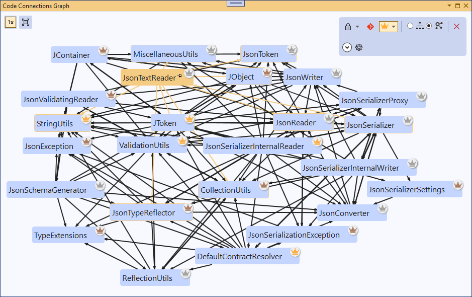

# Code Connections for Visual Studio

See the connections in your C# code. Open any class, and see its dependencies (the other types in your solution it refers to) and dependents (the types that refer to it) mapped out as a graph. Make changes to your code and the graph updates on the fly. You can use Code Connections to gain new  insights into your code, to orient yourself in an unfamiliar codebase, to organise source control changes, as a navigation tool, and more.

## Prerequisites

Visual Studio 2022 for Windows

## Get started

1. Install the [Code Connections Visual Studio extension](https://marketplace.visualstudio.com/items?itemName=DavidOliver.codeconnections).

2. Run Visual Studio.

3. Under `View > Other Windows`, select the `Code Connections Graph` window.

The Graph window is where all the action happens. Here you can visualize the dependency relationships between the types in your solution. You can add types manually, automatically, or both at once.

## Adding elements to the graph

### Always include active document and its connections

By default, the active document (ie the current tab) will be included in the graph. To toggle this behavior, press the lock icon in the options panel.

You can choose via the dropdown whether to include the active document and also all its connections (dependencies and dependents), or the active document only.

### Select a graph element

Selecting any element in the graph will open the corresponding file for that type. Connections from the selected element will be visually highlighted. If 'Always include active document and its connections' is enabled, the connections of the selected element will be added to the graph.

### Pin elements to graph

Elements can be pinned to the graph to stay present even while changing the active document.

Use the pin icon to pin or unpin an individual element.

Right-clicking an element brings up a context menu with more options:

 * **Pin/unpin element** will pin or unpin the current element (the same as the pin icon).
 * **Add connections of `Foo`** will add the current element and all its direct connections (dependencies and dependents).
 * **Add all base types of `Foo`** will add all the base classes of the type that are in the solution (and match the filter settings), as well as all interfaces that the type implements.
 * **Add all subtypes derived from `Foo`** will add all the types that directly or indirectly derive from the type: if it's a class, all the classes that inherit from it, or if it's an interface, all the types that directly or indirectly implement it.
 * **Add direct subtypes of `Foo`** will add all the types that directly derive from the type: the immediate derived classes of a class, or the types that directly implement an interface.
 * **Add types that directly depend upon `Foo`** will add all the types that reference `Foo` to the graph.
 * **Add types directly depended upon by `Foo`** will add all the types referenced by `Foo` to the graph.
 * **Add types that indirectly depend upon `Foo`** will add the dependents tree of `Foo` - the types that reference `Foo`, the types that reference those types, the types that reference *those* types, and so on.
 * **Add types indirectly depended upon by `Foo`** will add the dependency tree of `Foo` - the types referenced by `Foo`, the types referenced by those types, the types referenced by *those* types, and so on.
 * **Add non-public dependencies of `Foo`** will add the non-public (ie internal) dependency tree of `Foo` - any non-public types referenced by `Foo`, any non-public types referenced by those types, and so on.
 * **Add all types in project** will add all the types in the same project as the current element.
 * **Add all types in solution** will add all types in the solution (and match the current filter settings) to the graph. For large solutions, this may take a very long time to render!

### Clear Graph

The Clear Graph button will clear all pinned elements and any custom inclusion modes like Git Mode. If 'Always include active document' is enabled, the active document and its connections will be kept.

## Top Types Mode

Enabling Top Types mode gives you a high-level overview of a solution. It automatically adds top-ranked types to the graph, as measured by one of several metrics.

Use the dropdown to choose from the following metrics:

 - **Number of dependents**
 - **Number of dependencies**
 - **Lines of code**
 - **Combined score (default)**

 Types with many direct dependents are consumed in many different parts of the code. Types with many dependencies tend to be 'doing a lot', and may for example contain important business logic. The Combined Score metric tries to combine the other metrics in a balanced way to show the overall most important types in the solution.

The number of Top Types to show can be configured under the 'More Options' expander. The default is 'Auto' which scales according to the size of the solution.

Top types in the graph are identified by a badge with a crown icon, which is colour-coded gold, silver or bronze according to how high the type scores on the selected metric.

## Git Mode

Enabling Git mode will automatically add all locally modified types to the graph. When Git mode is enabled, a badge in the upper right corner of the element indicates if it is a new or modified file.

## Hierarchy and Compact layouts

You can change the way elements are arranged relative to each other in the graph.

**Hierarchy** arranges elements vertically by dependency relationship, with dependencies above and dependents below. It's useful when you want to clearly see dependency relationships at a glance.

**Compact** arranges elements in a space-efficient way, without a fixed spatial order. It's useful when you want to visualize a large number of elements at a time.

## Filters

Expanding 'More options' on the options panel will show settings to filter the types that are visible. This lets you focus on what you're interested in, and can also speed up graph generation, particularly in large solutions.

 * **Included projects**: You can opt to exclude particular projects. Excluding a project here will ignore all the types in that project.
 * **Include generated?** You can opt to exclude generated types. A type is considered generated if it is defined entirely in generated code. If a type has both generated and nongenerated definitions (eg `MyType.cs` and also `MyType.g.cs`) it won't be covered by this flag.
 * **Include nested classes?** You can opt to exclude nested classes, ie classes defined inside of another class.

## Other settings

Additional options can be found under `Tools > Options > Code Connections`.

 * **Element warning threshold**: the tool will show a warning when the graph includes more than 100 elements, asking you to confirm that you really want to load them. This setting configures the number of elements that will be shown without any warning.
 * **Output verbosity**: You can disable log output from the tool entirely, or set to 'Diagnostic' to see all messages. 'Diagnostic' is primarily intended for debugging.

 

---

 

## Contribute to Code Connections

### Report an issue

If you encounter any issues with Code Connections, we welcome bug reports via https://github.com/davidjohnoliver/CodeConnections/issues. You can also submit feature requests and other feedback there, as well as upvote existing issues.

### Contribute code

Code Connections is free and open source, and anyone is welcome to contribute. 

If you're fixing a bug, make sure there's an open issue and post a comment on it to let other's know you're working on it.

If you have an idea for a new feature, create an issue with a description of the feature to get input and feedback from other contributors. We recommend you get buy-in on the feature design from the maintainers of Code Connections before you start writing code.
