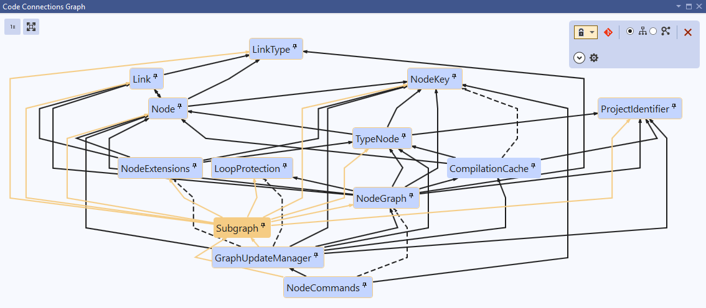

# Code Connections for Visual Studio

See the connections in your C# code. Open any class, and see its dependencies (the other types in your solution it refers to) and dependents (the types that refer to it) mapped out as a graph. Make changes to your code and the graph updates on the fly. You can use Code Connections to understand your code, to organise source control changes, or just as a navigation tool.

## Prerequisites

Visual Studio 2019 for Windows, 16.6 or higher

## Get started

1. Install the [Code Connections Visual Studio extension](https://marketplace.visualstudio.com/items?itemName=DavidOliver.codeconnections).

2. Run Visual Studio.

3. Under `View > Other Windows`, select the `Code Connections Graph` window.

## The dependency graph

The Graph window is where the action happens. Here you can visualize the dependency relationships between types in your solution.

## Adding elements to the graph

### Always include active document and its connections

By default, the active document (ie the current tab) will be included in the graph. To toggle this behavior, press the lock icon in the options panel.

You can choose via the dropdown whether to include the active document and also all its connections (dependencies and dependents), or the active document only.

### Select a graph element

Selecting any element in the graph will open the corresponding file for that type. Connections from the selected element will be visually highlighted. If 'Always include active document and its connections' is enabled, the connections of the selected element will be added to the graph.

### Pin elements to graph

Elements can be pinned to the graph to stay present even while changing the active document.

Use the pin icon to pin or unpin an individual element.

Right-clicking an element brings up a context menu with more options:

 * **Pin/unpin element** will pin or unpin the current element (the same as the pin icon).
 * **Add connections of type** will add the current element and all its direct connections (dependencies and dependents).
 * **Add all base types of type** will add all the base classes of the type that are in the solution (and match the filter settings), as well as all interfaces that the type implements.
 * **Add all subtypes derived from type** will add all the types that directly or indirectly derive from the type: if it's a class, all the classes that inherit from it, or if it's an interface, all the types that directly or indirectly implement it.
 * **Add direct subtypes of type** will add all the types that directly derive from the type: the immediate derived classes of a class, or the types that directly implement an interface.

### Clear Graph

The Clear Graph button will clear all pinned elements and any custom inclusion modes like Git Mode. If 'Always include active document' is enabled, the active document and its connections will be kept.

## Git Mode

Enabling Git Mode will automatically pin all locally modified types to the graph. When Git mode is enabled, an icon in the upper right corner of the element indicates if it is a new or modified file.

## Hierarchy and Compact layouts

You can change the way elements are arranged relative to each other in the graph.

**Hierarchy** arranges elements vertically by dependency relationship, with dependencies above and dependents below. It's useful when you want to clearly see dependency relationships at a glance.

**Compact** arranges elements in a space-efficient way, without a fixed spatial order. It's useful when you want to visualize a large number of elements at a time.

## Filters

Expanding 'More options' on the options panel will show settings to filter the types that are visible. This lets you focus on what you're interested in, and can also speed up graph generation, particularly in large solutions.

 * **Included projects**: You can opt to exclude particular projects. Excluding a project here will ignore all the types in that project.
 * **Include generated?** You can opt to exclude generated types. A type is considered generated if it is defined entirely in generated code. If a type has both generated and nongenerated definitions (eg `MyType.cs` and also `MyType.g.cs`) it won't be covered by this flag.
 * **Include nested classes?** You can opt to exclude nested classes, ie classes defined inside of another class.

## Other settings

Additional options can be found under `Tools > Options > Code Connections`.

 * **Element warning threshold**: the tool will show a warning when the graph includes more than 100 elements, asking you to confirm that you really want to load them. This setting configures the number of elements that will be shown without any warning.
 * **Output verbosity**: You can disable log output from the tool entirely, or set to 'Diagnostic' to see all messages. 'Diagnostic' is primarily intended for debugging.